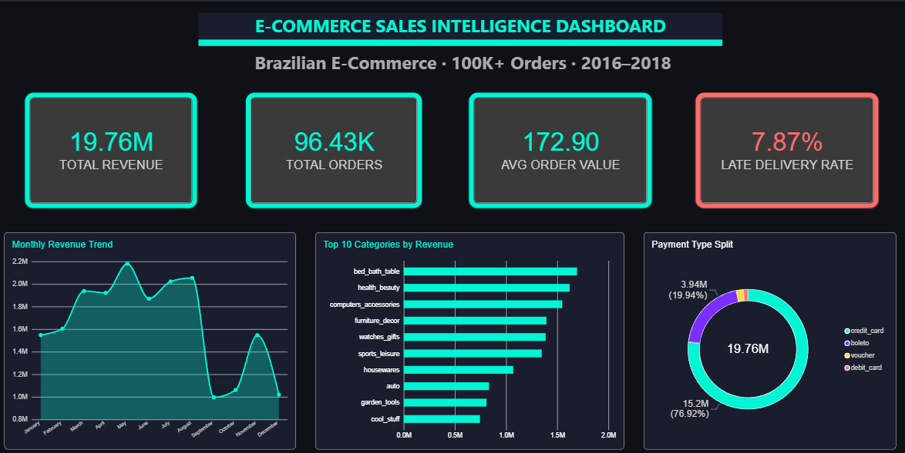
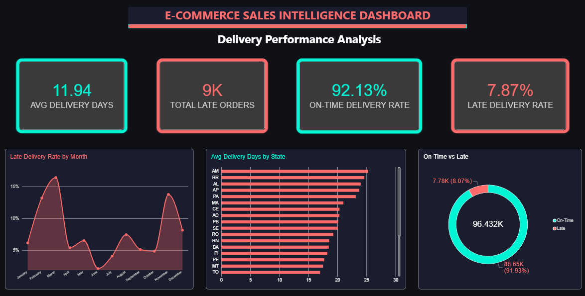
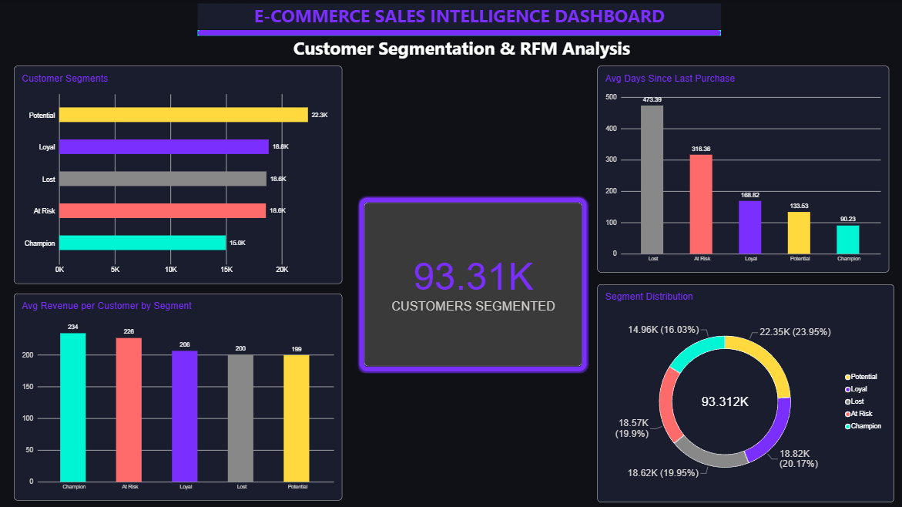

# 🛒 E-Commerce Sales Intelligence Dashboard
> End-to-end analytics project | Python · SQL · Power BI | 100K+ Real Orders


---

## 🎯 What This Project Does

Most e-commerce businesses sit on mountains of data but can't answer basic questions:
- *Which customers are about to churn?*
- *Why are deliveries late in certain states?*
- *Which product categories are actually driving revenue?*

This project answers all of them — using **100,000+ real orders** from Olist, Brazil's largest e-commerce marketplace, analyzed end-to-end from raw CSV files to an interactive 3-page Power BI dashboard.

---

## 📸 Dashboard Preview

### Page 1 — Sales Overview


### Page 2 — Delivery Performance


### Page 3 — Customer Intelligence


---

## 🔍 Business Questions Answered

| # | Question | Answer Found |
|---|----------|-------------|
| 1 | Which categories drive the most revenue? | Bed & Bath Table — R$1.7M (3x next category) |
| 2 | When did revenue peak? | November 2017 — R$2.2M (Black Friday effect) |
| 3 | Which states have worst delivery? | Amazonas (AM) — 25+ days avg (2x national avg) |
| 4 | What % of orders are late? | 7.87% — spiked to 16% in April 2017 |
| 5 | Who are our best customers? | 15K Champions — R$234 avg spend, 90-day recency |
| 6 | How many customers are at risk? | 18.6K At-Risk + 18.6K Lost — need win-back campaign |

---

## 🛠️ Tech Stack

```
Data Cleaning    →  Python (Pandas, NumPy)
Data Modeling    →  SQL (Joins, CTEs, Window Functions, Aggregations)
Segmentation     →  RFM Analysis (Recency, Frequency, Monetary)
Retention        →  Cohort Analysis (24-month retention table)
Visualization    →  Power BI (DAX Measures, Drill-through, KPI Cards)
```

---

## 📊 Dataset

**Source:** [Olist Brazilian E-Commerce Dataset](https://www.kaggle.com/datasets/olistbr/brazilian-ecommerce) — Kaggle

| Table | Records | Contains |
|-------|---------|----------|
| Orders | 99,441 | Status, timestamps, delivery dates |
| Customers | 99,441 | Location, unique IDs |
| Order Items | 112,650 | Products, prices, freight |
| Payments | 103,886 | Method, value, installments |
| Products | 32,951 | Category, dimensions, weight |
| Sellers | 3,095 | Location by state |
| Reviews | 100,000+ | Ratings, comments |

---

## 🔄 End-to-End Workflow

```
Step 1 — Ingestion
  Load 9 raw CSV tables using Python (Pandas)

Step 2 — Cleaning
  Handle 2,965 null delivery dates
  Fix date formats across 5 timestamp columns
  Remove outliers (delivery > 120 days, payment ≤ 0)

Step 3 — Merging
  Join all 9 tables into one master table (110,000+ rows)
  Aggregate payments per order to avoid duplicate rows

Step 4 — Feature Engineering
  delivery_days = delivered_date - purchase_date
  is_late = delivered_date > estimated_date
  delivery_status = On-Time / Late label
  order_month = purchase month for trend analysis

Step 5 — RFM Segmentation
  Score 93,312 customers on Recency, Frequency, Monetary
  Classify into 5 behavioral segments

Step 6 — Cohort Analysis
  Build 24-month retention table
  Identify critical drop-off windows

Step 7 — Power BI Dashboard
  3 pages, 15+ visuals, DAX measures, drill-through
```

---

## 📈 Dashboard Pages

### 🟢 Page 1 — Sales Overview
| KPI | Value |
|-----|-------|
| Total Revenue | R$ 19.76M |
| Total Orders | 96.43K |
| Avg Order Value | R$ 172.90 |
| Late Delivery Rate | 7.87% |

**Visuals:** Monthly Revenue Trend · Top 10 Categories · Payment Type Split

---

### 🔴 Page 2 — Delivery Performance
| KPI | Value |
|-----|-------|
| Avg Delivery Days | 11.94 |
| On-Time Rate | 92.13% |
| Total Late Orders | 9K |
| Worst State | Amazonas (AM) |

**Visuals:** Late Rate Trend · Avg Days by State · On-Time vs Late Donut

---

### 🟣 Page 3 — Customer Intelligence
| KPI | Value |
|-----|-------|
| Customers Segmented | 93.31K |
| Champions | 15K (16%) |
| At Risk | 18.6K (20%) |
| Lost | 18.6K (20%) |

**Visuals:** RFM Segment Bar · Avg Revenue by Segment · Recency by Segment · Segment Donut

---

## 👥 RFM Segmentation Results

| Segment | Count | Avg Revenue | Avg Recency | Recommended Action |
|---------|-------|-------------|-------------|-------------------|
| 🏆 Champion | 15K | R$234 | 90 days | Reward & retain |
| 💜 Loyal | 18.8K | R$228 | 134 days | Upsell & cross-sell |
| 🌱 Potential | 22.3K | R$199 | 169 days | Convert to loyal |
| ⚠️ At Risk | 18.6K | R$200 | 316 days | Win-back campaign |
| ❌ Lost | 18.6K | R$206 | 473 days | Re-engagement offer |

---

## 💡 Key Business Insights & Recommendations

### 1. Revenue Concentration Risk
**Finding:** Top 3 categories (Bed & Bath, Health & Beauty, Computer Accessories) account for 40%+ of revenue.
**Recommendation:** Diversify merchant acquisition into mid-tier categories to reduce concentration risk.

### 2. Delivery Crisis in Northern States
**Finding:** Amazonas (AM) and Roraima (RR) average 25+ delivery days — more than double the national average of 11.94 days.
**Recommendation:** Partner with regional logistics providers or establish distribution hubs in northern Brazil.

### 3. Late Delivery Spike — April 2017
**Finding:** Late delivery rate hit 16% in April 2017 — double the baseline of 7-8%.
**Recommendation:** Investigate carrier capacity issues during this period; implement surge logistics contracts.

### 4. At-Risk Customer Win-Back Opportunity
**Finding:** 18.6K At-Risk customers haven't purchased in 316 days on average but previously spent R$200.
**Recommendation:** Launch targeted discount campaign (15-20% off) within a 30-day window — estimated recovery of R$3.7M in revenue.

### 5. Credit Card Dominance
**Finding:** 76.92% of payments via credit card; boleto accounts for 19.94%.
**Recommendation:** Introduce installment-friendly options for higher-ticket categories to increase AOV.

---

## 📁 Repository Structure

```
ecommerce-da-project/
│
├── 📄 analysis.py              # Complete Python pipeline
├── 📊 rfm_segments.csv         # RFM scores — 93K customers
├── 📊 cohort_retention.csv     # 24-month cohort retention
├── 📊 monthly_revenue.csv      # Monthly revenue summary
├── 📊 delivery_performance.csv # Delivery metrics by state
└── 📖 README.md
```

---

## 🚀 How to Reproduce

```bash
# 1. Clone the repo
git clone https://github.com/Kushagra40/ecommerce-da-project.git

# 2. Install dependencies
pip install pandas numpy matplotlib seaborn sqlalchemy openpyxl

# 3. Download dataset from Kaggle
# https://www.kaggle.com/datasets/olistbr/brazilian-ecommerce

# 4. Update data_path in analysis.py to your local folder

# 5. Run the analysis
python analysis.py
```

---

## 👨‍💻 About

**Kumar Kushagra** — Final-year Mechanical Engineering student at BIT Mesra
Seeking Data Analyst / Business Analyst roles

[](https://www.linkedin.com/in/kumarkushagra40/)
[](https://github.com/Kushagra40)
